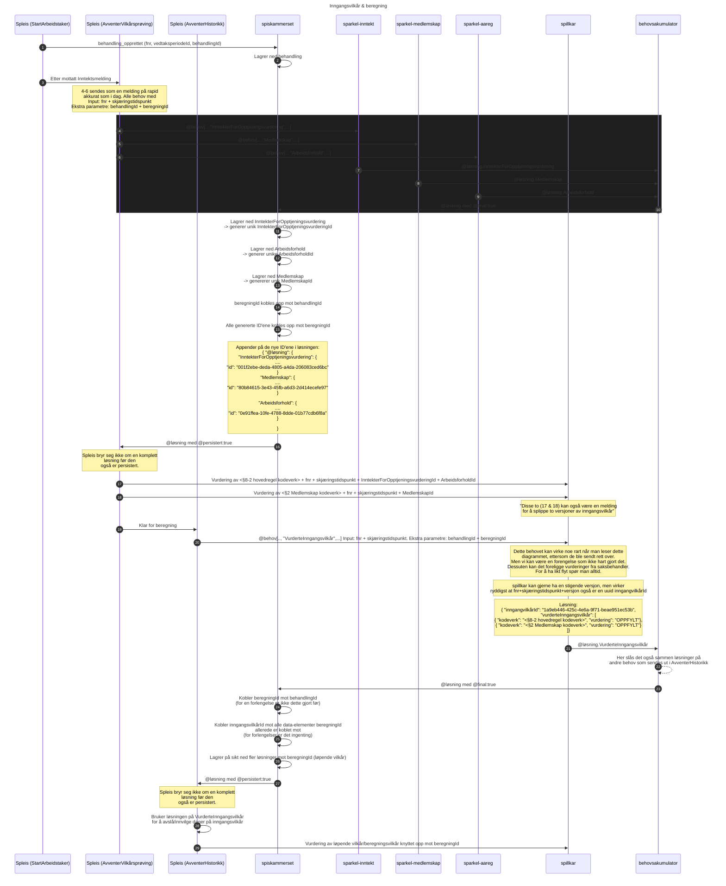

```mermaid
sequenceDiagram
autonumber
title Inngangsvilkår & beregning
participant Spleis (StartArbeidstaker)
participant Spleis (AvventerVilkårsprøving)
participant Spleis (AvventerHistorikk)
# For å kunne tegne opp pølser også før vilkårsprøving
Spleis (StartArbeidstaker) ->> spiskammerset: behandling_opprettet (fnr, vedtaksperiodeId, behandlingId)
spiskammerset ->> spiskammerset: Lagrer ned behandling
# Klar for vilkårsprøving
Spleis (StartArbeidstaker) ->> Spleis (AvventerVilkårsprøving): Etter mottatt Inntektsmelding
Note over Spleis (AvventerVilkårsprøving): 4-6 sendes som en melding på rapid<br/>akkurat som i dag. Alle behov med<br/>Input: fnr + skjæringstidspunkt<br/>Ekstra parametre: behandlingId + beregningId
rect rgb(30, 30, 30)
Spleis (AvventerVilkårsprøving) ->> sparkel-inntekt: @behov[.., "InntekterForOpptjeningsvurdering",...]
Spleis (AvventerVilkårsprøving) ->> sparkel-medlemskap: @behov[.., "Medlemskap",...] 
Spleis (AvventerVilkårsprøving) ->> sparkel-aareg: @behov[.., "Arbeidsforhold",...]
# Behovsriggen
participant spillkar
sparkel-inntekt ->> behovsakumulator: @løsning.InntekterForOpptjeningsvurdering
sparkel-medlemskap ->> behovsakumulator: @løsning.Medlemskap
sparkel-aareg ->> behovsakumulator: @løsning.Arbeidsforhold
behovsakumulator ->> spiskammerset: @løsning med @final:true
end
# NÅ starter det noe nytt
spiskammerset ->> spiskammerset: Lagrer ned InntekterForOpptjeningsvurdering<br/>-> generer unik InntekterForOpptjeningsvurderingId
spiskammerset ->> spiskammerset: Lagrer ned Arbeidsforhold<br/>-> generer unike ArbeidsforholdId
spiskammerset ->> spiskammerset: Lagrer ned Medlemskap<br/>-> genererer unik MedlemskapId
spiskammerset ->> spiskammerset: beregningId kobles opp mot behandlingId
spiskammerset ->> spiskammerset: Alle genererte ID'ene kobles opp mot beregningId
note over spiskammerset: Appender på de nye ID'ene i løsningen:<br/>{ "@løsning": {<br/> "InntekterForOpptjeningsvurdering": {<br/>....<br/>"id": "001f2ebe-deda-4805-a4da-206083ced6bc"<br/>}<br/>"Medlemskap": {<br/>....<br/>"id": "80b84615-3e43-45fb-a6d3-2d414ecefe97"<br/>}<br/><br/>"Arbeidsforhold": {<br/>....<br/>"id": "0e91ffea-10fe-4788-8dde-01b77cdb6f8a"<br/>}<br/><br/>}
spiskammerset ->> Spleis (AvventerVilkårsprøving): @løsning med @persistert:true
# Vi gjør vurderinger av inngangsvilår i Splies, og sender dem til spillkar
note over Spleis (AvventerVilkårsprøving):Spleis bryr seg ikke om en komplett<br/>løsning før den<br/>også er persistert.
Spleis (AvventerVilkårsprøving) ->> spillkar: Vurdering av <§8-2 hovedregel kodeverk> + fnr + skjæringstidspunkt + InntekterForOpptjeningsvurderingId + ArbeidsforholdId
Spleis (AvventerVilkårsprøving) ->> spillkar: Vurdering av <§2 Medlemskap kodeverk> + fnr + skjæringstidspunkt + MedlemskapId
note over spillkar: "Disse to (17 & 18) kan også være en melding<br/>for å splippe to versjoner av inngangsvilkår"
# Sender behov akkurat som i dag, men nytt behov VurderteInngangsvilkår
Spleis (AvventerVilkårsprøving) ->> Spleis (AvventerHistorikk): Klar for beregning
Spleis (AvventerHistorikk) ->> spillkar: @behov[.., "VurderteInngangsvilkår",...] Input: fnr + skjæringstidspunkt. Ekstra parametre: behandlingId + beregningId
note over spillkar: Dette behovet kan virke noe rart når man leser dette<br/>diagrammet, ettersom de ble sendt rett over.<br/>Men vi kan være en forengelse som ikke hart gjort det.<br/>Dessuten kan det foreligge vurderinger fra saksbehandler.<br/>For å ha likt flyt spør man alltid.
note over spillkar: spillkar kan gjerne ha en stigende versjon, men virker <br/>ryddigst at fnr+skjæringstidspunkt+versjon også er en uuid inngangvilkårId
note over spillkar: Løsning:<br/>{ "inngangvilkårId": "1a9eb446-425c-4e6a-9f71-beae951ec53b",<br/>"vurderteInngangsvilkår": [<br/>{ "kodeverk": "<§8-2 hovedregel kodeverk>", "vurdering": "OPPFYLT"},<br/>{ "kodeverk": "<§2 Medlemskap kodeverk>", "vurdering": "OPPFYLT"}<br/>]}
spillkar ->> behovsakumulator: @løsning.VurderteInngangsvilkår
behovsakumulator -->> behovsakumulator: Her slås det også sammen løsninger på<br/>andre behov som sendes ut i AvventerHistorikk
behovsakumulator ->> spiskammerset: @løsning med @final:true
spiskammerset ->> spiskammerset: Kobler beregningId mot behandlingId<br/> (for en forlengelse er ikke dette gjort før)
spiskammerset ->> spiskammerset: Kobler inngangsvilkårId mot alle data-elementer beregningId<br/>allerede er koblet mot<br/>(for forlengelser er det ingenting)
spiskammerset ->> spiskammerset: Lagrer på sikt ned fler løsninger mot beregningId (løpende vilkår)
# Så er vi i spleis igjen
spiskammerset ->> Spleis (AvventerHistorikk): @løsning med @persistert:true
note over Spleis (AvventerHistorikk):Spleis bryr seg ikke om en komplett<br/>løsning før den<br/>også er persistert.
Spleis (AvventerHistorikk) ->> Spleis (AvventerHistorikk): Bruker løsningen på VurderteInngangsvilkår<br/>for å avslå/innvilge dager på inngangsvilkår 
Spleis (AvventerHistorikk) ->> spillkar: Vurdering av løpende vilkår/beregningsvilkår knyttet opp mot beregningId
```