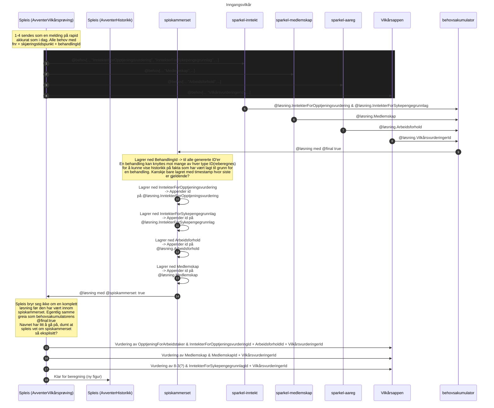

```mermaid
sequenceDiagram
autonumber
title Inngangsvilkår
Note over Spleis (AvventerVilkårsprøving): 1-4 sendes som en melding på rapid<br/>akkurat som i dag. Alle behov med<br/> fnr + skjæringstidspunkt + behandlingId
participant Spleis (AvventerHistorikk)
participant spiskammerset
rect rgb(30, 30, 30)
Spleis (AvventerVilkårsprøving) ->> sparkel-inntekt: @behov[.., "InntekterForOpptjeningsvurdering", "InntekterForSykepengegrunnlag",...]
Spleis (AvventerVilkårsprøving) ->> sparkel-medlemskap: @behov[.., "Medlemskap",...]
Spleis (AvventerVilkårsprøving) ->> sparkel-aareg: @behov[.., "Arbeidsforhold",...]
Spleis (AvventerVilkårsprøving) ->> Vilkårsappen: @behov[.., "VilkårsvurderingerId",...]
end
sparkel-inntekt ->> behovsakumulator: @løsning.InntekterForOpptjeningsvurdering & @løsning.InntekterForSykepengegrunnlag
sparkel-medlemskap ->> behovsakumulator: @løsning.Medlemskap
sparkel-aareg ->> behovsakumulator: @løsning.Arbeidsforhold
Vilkårsappen ->> behovsakumulator: @løsning.VilkårsvurderingerId
behovsakumulator ->> spiskammerset: @løsning med @final true
note over spiskammerset: Lagrer ned BehandlingId -> til alle genererte ID'er<br/>En behandling kan knyttes mot mange av hver type ID(reberegnes)<br/>for å kunne vise historikk på fakta som har vært lagt til grunn for<br/>en behandling. Kanskje bare lagret med timestamp hvor siste<br/>er gjeldende?
spiskammerset ->> spiskammerset: Lagrer ned InntekterForOpptjeningsvurdering<br/> -> Appender id<br/>på @løsning.InntekterForOpptjeningsvurdering
spiskammerset ->> spiskammerset: Lagrer ned InntekterForSykepengegrunnlag<br/> -> Appender id på<br/>@løsning.InntekterForSykepengegrunnlag
spiskammerset ->> spiskammerset: Lagrer ned Arbeidsforhold<br/> -> Appender id på<br/>@løsning.Arbeidsforhold
spiskammerset ->> spiskammerset: Lagrer ned Medlemskap<br/> -> Appender id på<br/>@løsning.Medlemskap
spiskammerset ->> Spleis (AvventerVilkårsprøving): @løsning med @spiskammerset: true
note over Spleis (AvventerVilkårsprøving):Spleis bryr seg ikke om en komplett<br/>løsning før den har vært innom<br/>spiskammerset. Egentlig samme<br/>greia som behovsakumulatorens<br/>@final:true<br/>Navnet har litt å gå på, dumt at<br/>spleis vet om spiskammerset<br/>så eksplisitt?
Spleis (AvventerVilkårsprøving) ->> Vilkårsappen: Vurdering av OpptjeningForArbeidstaker & InntekterForOpptjeningsvurderingId + ArbeidsforholdId + VilkårsvurderingerId
Spleis (AvventerVilkårsprøving) ->> Vilkårsappen: Vurdering av Medlemskap & MedlemskapId + VilkårsvurderingerId
Spleis (AvventerVilkårsprøving) ->> Vilkårsappen: Vurdering av 8-3(?) & InntekterForSykepengegrunnlagId + VilkårsvurderingerId
Spleis (AvventerVilkårsprøving) ->> Spleis (AvventerHistorikk): Klar for beregning (ny figur)
```