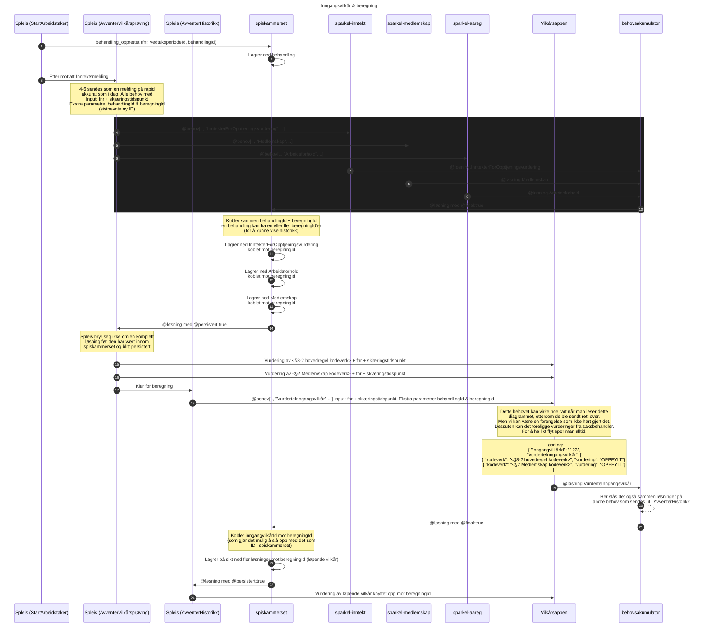

```mermaid
sequenceDiagram
autonumber
title Inngangsvilkår & beregning
participant Spleis (StartArbeidstaker)
participant Spleis (AvventerVilkårsprøving)
participant Spleis (AvventerHistorikk)
Spleis (StartArbeidstaker) ->> spiskammerset: behandling_opprettet (fnr, vedtaksperiodeId, behandlingId)
spiskammerset ->> spiskammerset: Lagrer ned behandling
Spleis (StartArbeidstaker) ->> Spleis (AvventerVilkårsprøving): Etter mottatt Inntektsmelding
Note over Spleis (AvventerVilkårsprøving): 4-6 sendes som en melding på rapid<br/>akkurat som i dag. Alle behov med<br/>Input: fnr + skjæringstidspunkt<br/>Ekstra parametre: behandlingId & beregningId<br/>(sistnevnte ny ID)
rect rgb(30, 30, 30)
Spleis (AvventerVilkårsprøving) ->> sparkel-inntekt: @behov[.., "InntekterForOpptjeningsvurdering",...]
Spleis (AvventerVilkårsprøving) ->> sparkel-medlemskap: @behov[.., "Medlemskap",...] 
Spleis (AvventerVilkårsprøving) ->> sparkel-aareg: @behov[.., "Arbeidsforhold",...]
participant Vilkårsappen
sparkel-inntekt ->> behovsakumulator: @løsning.InntekterForOpptjeningsvurdering
sparkel-medlemskap ->> behovsakumulator: @løsning.Medlemskap
sparkel-aareg ->> behovsakumulator: @løsning.Arbeidsforhold
behovsakumulator ->> spiskammerset: @løsning med @final:true
end
note over spiskammerset: Kobler sammen behandlingId + beregningId<br/>en behandling kan ha en eller fler beregningId'er<br/>(for å kunne vise historikk)
spiskammerset ->> spiskammerset: Lagrer ned InntekterForOpptjeningsvurdering<br/>koblet mot beregningId
spiskammerset ->> spiskammerset: Lagrer ned Arbeidsforhold<br/>koblet mot beregningId
spiskammerset ->> spiskammerset: Lagrer ned Medlemskap<br/>koblet mot beregningId
spiskammerset ->> Spleis (AvventerVilkårsprøving): @løsning med @persistert:true
note over Spleis (AvventerVilkårsprøving):Spleis bryr seg ikke om en komplett<br/>løsning før den har vært innom<br/>spiskammerset og blitt persistert
Spleis (AvventerVilkårsprøving) ->> Vilkårsappen: Vurdering av <§8-2 hovedregel kodeverk> + fnr + skjæringstidspunkt
Spleis (AvventerVilkårsprøving) ->> Vilkårsappen: Vurdering av <§2 Medlemskap kodeverk> + fnr + skjæringstidspunkt
Spleis (AvventerVilkårsprøving) ->> Spleis (AvventerHistorikk): Klar for beregning
Spleis (AvventerHistorikk) ->> Vilkårsappen: @behov[.., "VurderteInngangsvilkår",...] Input: fnr + skjæringstidspunkt. Ekstra parametre: behandlingId & beregningId
note over Vilkårsappen: Dette behovet kan virke noe rart når man leser dette<br/>diagrammet, ettersom de ble sendt rett over.<br/>Men vi kan være en forengelse som ikke hart gjort det.<br/>Dessuten kan det foreligge vurderinger fra saksbehandler.<br/>For å ha likt flyt spør man alltid.
note over Vilkårsappen: Løsning:<br/>{ "inngangvilkårId": "123",<br/>"vurderteInngangsvilkår": [<br/>{ "kodeverk": "<§8-2 hovedregel kodeverk>", "vurdering": "OPPFYLT"},<br/>{ "kodeverk": "<§2 Medlemskap kodeverk>", "vurdering": "OPPFYLT"}<br/>]}
Vilkårsappen ->> behovsakumulator: @løsning.VurderteInngangsvilkår
behovsakumulator -->> behovsakumulator: Her slås det også sammen løsninger på<br/>andre behov som sendes ut i AvventerHistorikk
behovsakumulator ->> spiskammerset: @løsning med @final:true
note over spiskammerset: Kobler inngangvilkårId mot beregningId<br/>(som gjør det mulig å slå opp med det som<br/> ID i spiskammerset)
spiskammerset ->> spiskammerset: Lagrer på sikt ned fler løsninger mot beregningId (løpende vilkår)
spiskammerset ->> Spleis (AvventerHistorikk): @løsning med @persistert:true
Spleis (AvventerHistorikk) ->> Vilkårsappen: Vurdering av løpende vilkår knyttet opp mot beregningId
```